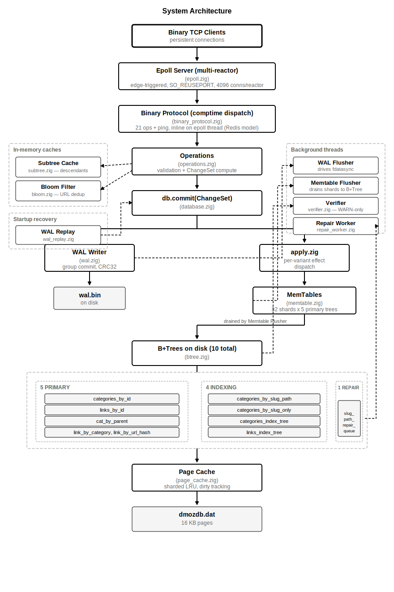
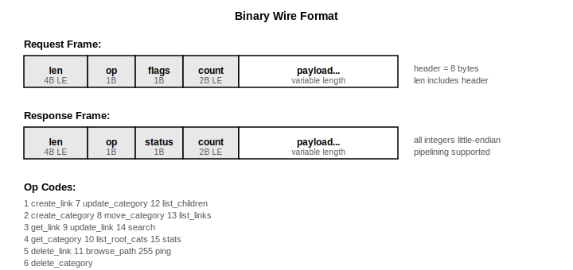
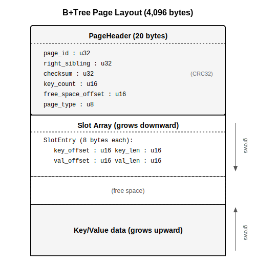
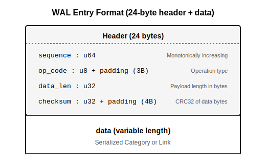
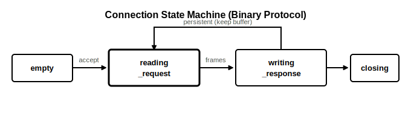
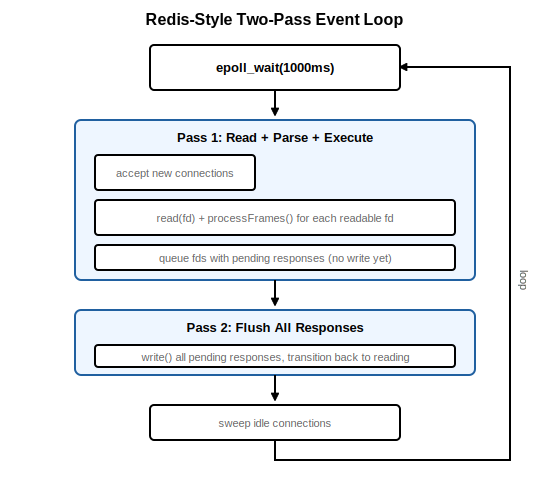
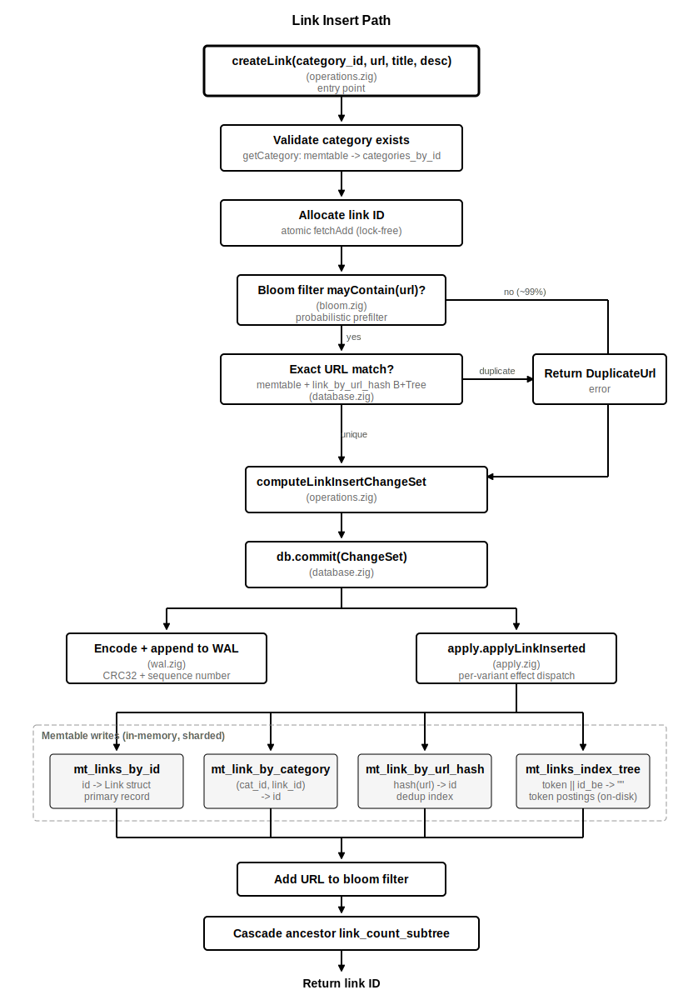
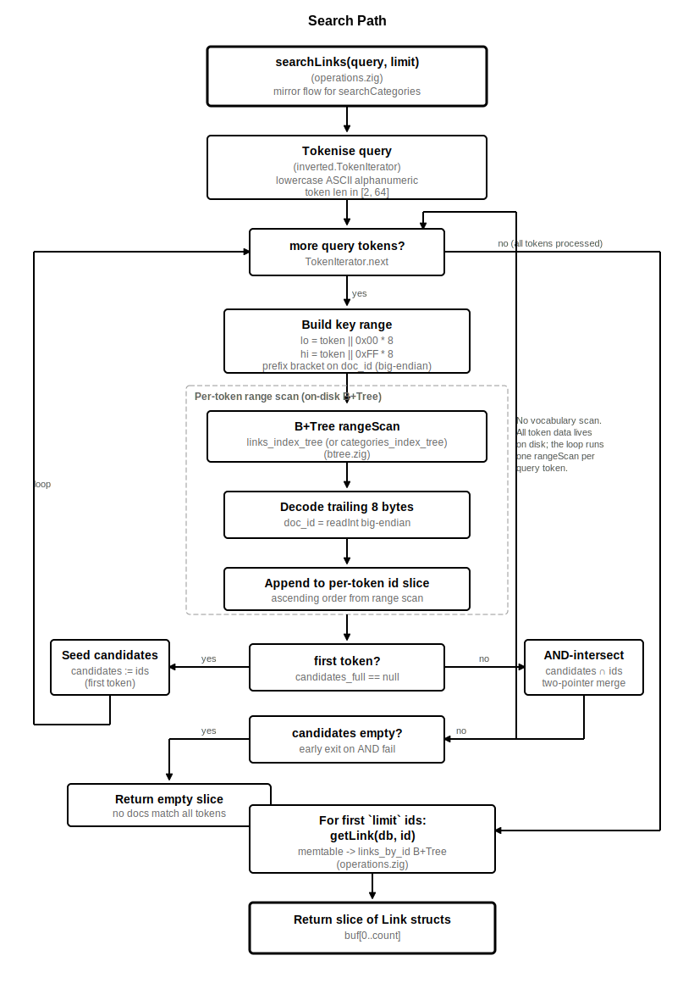

# zig-directory

A high-performance, DMOZ-inspired web directory server with a custom embedded database engine. Built entirely in Zig
with zero external dependencies. Binary-only TCP protocol processed inline on the epoll thread (Redis model).

---

## Table of Contents

- [Features](#features)
- [Architecture](#architecture)
  - [System Overview](#system-overview)
  - [Storage Engine](#storage-engine)
  - [Network Layer](#network-layer)
  - [Durability](#durability)
- [Getting Started](#getting-started)
  - [Prerequisites](#prerequisites)
  - [Build from Source](#build-from-source)
  - [Run with Docker](#run-with-docker)
  - [Development Container](#development-container)
- [Configuration](#configuration)
- [Binary Protocol Reference](#binary-protocol-reference)
  - [Wire Format](#wire-format)
  - [Op Codes](#op-codes)
  - [Status Codes](#status-codes)
  - [CRUD Operations](#crud-operations)
  - [Query Operations](#query-operations)
  - [Update Operations](#update-operations)
  - [System Operations](#system-operations)
- [Testing](#testing)
  - [Unit and Integration Tests](#unit-and-integration-tests)
  - [Load Testing](#load-testing)
- [Kubernetes Deployment](#kubernetes-deployment)
- [Project Structure](#project-structure)
- [Architecture Deep Dive](#architecture-deep-dive)
  - [B+Tree Index Engine](#btree-index-engine)
  - [Page Cache (Buffer Pool)](#page-cache-buffer-pool)
  - [Write-Ahead Log](#write-ahead-log)
  - [Slug Path Resolution](#slug-path-resolution)
  - [Slug-Path Repair Queue](#slug-path-repair-queue)
  - [Connection State Machine](#connection-state-machine)
  - [Event Loop](#event-loop)
  - [Link Insert Path](#link-insert-path)
  - [Search](#search)
- [Operational Guide](#operational-guide)
- [Contributing](#contributing)

---

## Features

- **Custom B+Tree storage engine** with 16 KB pages, LRU page cache, and free-list management
- **Write-Ahead Log (WAL)** with group commit for crash recovery
- **Snapshots** with atomic write-to-temp-then-rename
- **Binary TCP protocol** with 21 ops + ping, comptime-generated dispatch, processed inline on epoll thread
- **Multi-reactor epoll** with edge-triggered non-blocking I/O and SO_REUSEPORT
- **Redis-style two-pass event loop** -- read all, then write all (no per-request syscall overhead)
- **4,096 concurrent connections** per reactor with per-connection state machine
- **Hierarchical categories** with slug-based path routing via on-disk B+Tree indices
- **Full-text search** across categories and links via inverted index
- **Duplicate URL detection** via bloom filter + hash index
- **Comptime-generic handlers** -- payload parsing, batch create, get/delete, list-of-struct, and bitmask updates are each one helper reused across ops
- **Zero external dependencies** -- pure Zig 0.15 + standard library
- **~17MB Docker image** (Alpine + static binary)

---

## Architecture

### System Overview

<p align="center">
  
</p>

> Diagram source: [`diagrams/01-system-architecture.mmd`](diagrams/01-system-architecture.mmd)

### Storage Engine

The database stores data in a single file (`dmozdb.dat`) organized as 16 KB pages:

- **Page 0**: File header (magic `DMOZ` / `0x444D4F5A`, version, root page pointers, ID counters)
- **Pages 1–6**: B+Tree root pages for the 5 primary indices and the slug-path repair queue (`slug_path_repair_queue`)
- The 4 indexing B+Tree roots (`categories_by_slug_path`, `categories_by_slug_only`, `categories_index_tree`, `links_index_tree`) are allocated by migration phase 8 on the first v2 → v3 upgrade and live anywhere in the file from then on
- **Pages 7+**: B+Tree internal/leaf nodes, data pages

Ten B+Trees back the read and write paths:

| Index                       | Key                       | Value                       | Purpose                                              |
|-----------------------------|---------------------------|-----------------------------|------------------------------------------------------|
| `categories_by_id`          | category ID               | Category (1,592 bytes)      | Primary category lookup                              |
| `cat_by_parent`             | parent_id ++ child_id     | child ID                    | Hierarchy traversal                                  |
| `links_by_id`               | link ID                   | Link (3,376 bytes)          | Primary link lookup                                  |
| `link_by_category`          | category_id ++ link_id    | link ID                     | Links within a category                              |
| `link_by_url_hash`          | hash(url)                 | link ID                     | Duplicate URL detection                              |
| `categories_by_slug_path`   | full slug path            | category ID                 | Slug-path → ID resolution                            |
| `categories_by_slug_only`   | leaf slug                 | category ID                 | Leaf-slug → ID (shallowest holder)                   |
| `categories_index_tree`     | token ‖ category ID (BE)  | (empty)                     | Posting list for category text search                |
| `links_index_tree`          | token ‖ link ID (BE)      | (empty)                     | Posting list for link text search                    |
| `slug_path_repair_queue`    | repair_seq (BE)           | RepairTask (1,056 bytes)    | Pending descendant slug-path cleanups (v4 schema)    |

### Network Layer

- **Binary TCP protocol** on a single port (default 8080)
- **Multi-reactor epoll** with `SO_REUSEPORT` -- kernel distributes connections across reactors
- **Edge-triggered events** (`EPOLLET`) for high-throughput I/O
- **Redis-style two-pass event loop** -- all reads processed before any writes (eliminates per-request `epoll_ctl` syscalls)
- **Inline frame processing** -- binary protocol ops run directly on the epoll thread (~3us per memtable put)
- **No thread pool** -- no context switches, no completion queue
- **8KB request buffers**, **64KB response buffers** per connection
- **TCP_NODELAY** for low-latency small frames

### Durability

Writes follow the WAL-first protocol via the ChangeSet pipeline:

1. **Compute** — `operations.compute*ChangeSet` builds a typed `ChangeSet` describing all the on-disk effects of the mutation (primary record write, secondary index updates, ancestor cascades, token entries, etc.).
2. **WAL append** — `db.commit(cs)` encodes the ChangeSet and appends it to the Write-Ahead Log (CRC32 + monotonic sequence number). Group commit batches up to `DMOZDB_WAL_BATCH_SIZE` entries (default 256) into a single `fdatasync`.
3. **Apply** — `apply.zig` walks the ChangeSet variants and stages each effect into the appropriate **memtable shard** (32 shards × 5 primary trees, plus direct writes to the 4 indexing trees and 1 repair queue).
4. **Background drain** — the memtable flusher thread periodically drains shards into the underlying B+Trees and the LRU page cache marks pages dirty.
5. **Snapshot** — periodic snapshots checkpoint dirty pages and record the WAL position.

On crash recovery: load the last snapshot, replay all WAL entries after the snapshot's checkpoint sequence by re-running `apply()` against each decoded ChangeSet. Recovery is dumb replay — no business logic, no cascade re-derivation.

---

## Getting Started

### Prerequisites

- **Zig 0.15.2** -- [install guide](https://ziglang.org/download/)
- **Docker** (optional, for containerized deployment)

### Build from Source

```bash
# Clone the repository
git clone <repo-url>
cd zig-directory

# Build (debug)
zig build

# Build (optimized release)
zig build -Doptimize=ReleaseSafe

# Run tests
zig build test

# Run the server
DMOZDB_PORT=8080 DMOZDB_DATA_DIR=./data ./zig-out/bin/dmozdb
```

### Run with Docker

```bash
# Build the Docker image
docker build -t dmozdb:latest .

# Run the container
docker run -d \
  --name dmozdb \
  -p 8080:8080 \
  -v dmozdb-data:/var/lib/dmozdb \
  dmozdb:latest
```

### Development Container

The project includes a full [Dev Container](.devcontainer/devcontainer.json) configuration for VS Code and GitHub Codespaces:

- Ubuntu 24.04 with Zig 0.15.2 and ZLS pre-installed
- Docker-in-Docker enabled for container builds
- VS Code extensions: Zig language support, GitLens, ShellCheck
- Port 8080 auto-forwarded

| Alias   | Command                               | Description             |
|---------|---------------------------------------|-------------------------|
| `zb`    | `zig build`                           | Build the project       |
| `zt`    | `zig build test`                      | Run all tests           |
| `zr`    | `zig build run`                       | Run the server          |
| `zfmt`  | `zig fmt src/`                        | Format all source files |
| `db`    | `docker build -t dmozdb .`            | Build Docker image      |
| `dr`    | `docker run --rm -p 8080:8080 dmozdb` | Run Docker container    |

---

## Configuration

All configuration is via environment variables. Every setting has a sensible default.

| Variable                      | Type   | Default           | Description                                               |
|-------------------------------|--------|-------------------|-----------------------------------------------------------|
| `DMOZDB_PORT`                 | u16    | `8080`            | Binary protocol listen port                               |
| `DMOZDB_BIND`                 | IPv4   | `127.0.0.1`       | Address to bind the listen socket                         |
| `DMOZDB_TRUSTED`              | string | (none)            | Comma separated list of IPv4 addresses allowed to connect |
| `DMOZDB_DATA_DIR`             | string | `/var/lib/dmozdb` | Directory for `dmozdb.dat`, `wal.bin`, snapshots          |
| `DMOZDB_CACHE_SIZE_MB`        | u32    | `256`             | LRU page cache size in megabytes                          |
| `DMOZDB_THREAD_COUNT`         | u32    | auto              | Number of reactor threads (0 = CPU count)                 |
| `DMOZDB_SNAPSHOT_INTERVAL_S`  | u32    | `300`             | Seconds between automatic snapshots                       |
| `DMOZDB_WAL_SYNC_INTERVAL_MS` | u32    | `50`              | WAL group-commit flush interval (ms)                      |
| `DMOZDB_WAL_BATCH_SIZE`       | u32    | `256`             | Max WAL entries before forced flush                       |
| `DMOZDB_RENAME_INLINE_THRESHOLD`           | u32    | `5000`            | Subtree size at which rename/move flips from in-line strict to queued async repair |
| `DMOZDB_REPAIR_WORKER_INTERVAL_MS`         | u32    | `1000`            | Repair-worker tick interval (ms)                          |
| `DMOZDB_REPAIR_WORKER_CHUNK_SIZE`          | u32    | `10000`           | Descendants processed per worker chunk before yielding the slug-path tree lock |
| `DMOZDB_REPAIR_WORKER_MAX_TASKS_PER_TICK`  | u32    | `1`               | Tasks pulled from the queue per tick                      |
| `DMOZDB_SUBTREE_SCAN_THRESHOLD`            | u32    | `1024`            | Descendant count above which `list_subtree_links` uses the sequential `link_by_category` scan; below it uses per-descendant rangescans (faster for small subtrees) |

---

## Binary Protocol Reference

### Wire Format

<p align="center">
  
</p>

> Diagram source: [`diagrams/05-binary-wire-format.mmd`](diagrams/05-binary-wire-format.mmd)

All frames share an 8-byte header. All integers are little-endian. `len` includes the header. Multiple frames can be pipelined on the same persistent TCP connection.

```
Request:  [4B len][1B op][1B flags][2B count][payload...]
Response: [4B len][1B op][1B status][2B count][payload...]
```

### Op Codes

| Code   | Op                     | Batch   | Description                            |
|--------|------------------------|---------|----------------------------------------|
| 1      | `create_link`          | yes     | Create links (count items)             |
| 2      | `create_category`      | yes     | Create categories (count items)        |
| 3      | `get_link`             | no      | Get link by ID                         |
| 4      | `get_category`         | no      | Get category by ID                     |
| 5      | `delete_link`          | no      | Delete link by ID                      |
| 6      | `delete_category`      | no      | Delete category by ID                  |
| 7      | `update_category`      | no      | Update category fields (bitmask)       |
| 8      | `move_category`        | no      | Move category to new parent            |
| 9      | `update_link`          | no      | Update link fields (bitmask)           |
| 10     | `list_root_categories` | no      | List root categories with pagination   |
| 11     | `browse_path`          | no      | Browse by slug path                    |
| 12     | `list_children`        | no      | List child categories with pagination  |
| 13     | `list_links`           | no      | List links in category with pagination |
| 14     | `search`               | no      | Full-text search categories and links  |
| 15     | `stats`                | no      | Database statistics                    |
| 16     | `list_all_links`       | no      | List links across all categories with pagination |
| 17     | `list_subtree_links`   | no      | List links in a subtree (transitive over all descendants) with pagination |
| 18     | `index_health`         | no      | Verifier snapshot + slug-path repair queue depth + worker counters |
| 19     | `run_verifier`         | no      | Wake the background verifier thread; returns the current snapshot |
| 20     | `rebuild_index`        | no      | **Reserved** — currently returns `invalid`; full implementation lands in Slice 5a |
| 255    | `ping`                 | no      | Ping/pong                              |

### Status Codes

| Code   | Status               | Meaning                              |
|--------|----------------------|--------------------------------------|
| 0      | `ok`                 | Success                              |
| 1      | `not_found`          | Resource not found                   |
| 2      | `duplicate`          | Duplicate URL                        |
| 3      | `invalid`            | Invalid request payload              |
| 4      | `err`                | Internal error                       |
| 5      | `category_not_found` | Category does not exist              |
| 6      | `has_children`       | Cannot delete: category has children |
| 7      | `circular`           | Circular hierarchy detected          |

### CRUD Operations

**Create link (op=1, batch)**
```
Request payload per item:
  [u64 category_id][u16 url_len][url][u16 title_len][title][u16 desc_len][desc]

Response per item:
  [u8 status][u64 link_id]
```

**Create category (op=2, batch)** -- same layout with `[u64 parent_id][name][slug][desc]`.

**Get link/category (op=3/4)**
```
Request:  [u64 id]
Response: [full extern struct bytes]   (Link=3376B, Category=1592B)
```

**Delete link/category (op=5/6)**
```
Request:  [u64 id]
Response: header only (status in header)
```

### Query Operations

**List root categories (op=10)**
```
Request:  [u32 offset][u32 limit]
Response: header (count=N) + [N x Category struct bytes]
```

**List children (op=12)**
```
Request:  [u64 parent_id][u32 offset][u32 limit]
Response: header (count=N) + [N x Category struct bytes]
```

**List links (op=13)**
```
Request:  [u64 category_id][u32 offset][u32 limit]
Response: header (count=N) + [N x Link struct bytes]
```

**Browse path (op=11)**
```
Request:  [u16 path_len][path]   e.g. "Computers/Programming"
Response: [Category bytes][u16 child_count][children...][u16 link_count][links...]
```

**Search (op=14)**
```
Request:  [u16 query_len][query][u32 limit]
Response: [u16 cat_count][categories...][u16 link_count][links...]
```

### Update Operations

Update ops use a **bitmask byte** to indicate which fields are present.

**Update category (op=7)**
```
Request:  [u64 id][u8 bitmask][...present fields...]

Bitmask bits:
  0x01 = name    -> [u16 len][bytes]
  0x02 = slug    -> [u16 len][bytes]
  0x04 = desc    -> [u16 len][bytes]
```

**Update link (op=9)** -- same pattern with `0x01=url`, `0x02=title`, `0x04=desc`.

**Move category (op=8)**
```
Request:  [u64 category_id][u64 new_parent_id]
```

### System Operations

**Stats (op=15)**
```
Response: [u64 category_count][u64 link_count][u64 page_count]
          [u64 cache_hits][u64 cache_misses][u64 wal_pending]
```

**Index health (op=18)**
```
Response: header + state snapshot + repair-queue surface
  [i64 last_run_at][u8 index_count][N x (u8 name_len, name, u64 expected, u64 observed, u32 drift_bp)]
  [u64 slug_path_repair_queue_depth]
  [i64 slug_path_repair_worker_last_tick_ms]
  [u64 slug_path_repair_worker_tasks_processed]
  [u64 slug_path_repair_worker_chunks_processed]
```

**Run verifier (op=19)** -- wakes the background verifier thread; returns the current snapshot (same shape as op=18) immediately. The actual run completes asynchronously; poll op=18 for the updated `last_run_at`.

**Rebuild index (op=20)** -- reserved. Currently returns `invalid`. Full implementation lands in Slice 5a of the ISO-25010 quality roadmap.

**Ping (op=255)** -- empty request, empty response with `status=ok`.

---

## Testing

### Unit and Integration Tests

```bash
zig build test
```

Tests cover:

- **Page format** -- slot layout, insertion, deletion, free-space tracking
- **B+Tree** -- insert/search/delete with 500+ keys, range scans, node splits
- **Page cache** -- LRU eviction, pin/unpin, dirty tracking, flush
- **Free list** -- allocation and deallocation
- **Database** -- initialization, recovery, stats
- **Categories** -- CRUD, hierarchy, circular-hierarchy detection, move
- **Links** -- CRUD, duplicate URL rejection
- **Search** -- keyword matching across categories and links
- **WAL** -- append, replay, CRC32 validation
- **Snapshots** -- create and recovery
- **Binary protocol** -- comptime payload parsing, optional field bitmask
- **Connection** -- state machine transitions

### Load Testing

The `bench` harness (in `bench/`) covers seven workload groups with p50 / p95 / p99 / p99.9 latency percentiles, throughput, and RSS sampling — emitted as JSON Lines for cross-run comparison. It runs unconstrained or under cgroup-enforced 1 CPU / 2 GB and 2 CPU / 4 GB profiles via `systemd-run` wrappers.

```bash
zig build -Doptimize=ReleaseFast

# 1. Start the server, seed a deterministic fixture
mkdir -p /tmp/bench-data
DMOZDB_DATA_DIR=/tmp/bench-data ./zig-out/bin/dmozdb &
./zig-out/bin/bench seed --data-dir /tmp/bench-data --categories 1000 --links 100000

# 2. Run a write hammer
./zig-out/bin/bench create_link --workers 4 --batch 10 --ops-per-worker 20000 --output bench.jsonl

# 3. Run a constrained read sweep
./bench/run-constrained.sh 1cpu2gb -- get_link \
  --data-dir /tmp/bench-data --workers 4 --ops-per-worker 5000 --output bench.jsonl

# 4. Inspect
jq '[.profile, .workload, .latency_ns.p50, .latency_ns.p99, .ops_per_sec] | @tsv' bench.jsonl
```

Subcommands: `seed`, `create_link`, `get_link`, `browse {path|children|subtree-links}`, `search {links|categories}`, `mixed --read-pct PCT`, `cold {cache|boot}`. See [`bench/README.md`](bench/README.md) for the full reference, the matrix-runner example, and the JSON Lines schema.

---

## Kubernetes Deployment

Manifests are provided in `k8s/`:

```bash
kubectl apply -f k8s/namespace.yaml
kubectl create secret generic dmozdb-secrets -n dmozdb \
  --from-literal=admin-api-key=your-secret-key
kubectl apply -f k8s/service.yaml
kubectl apply -f k8s/statefulset.yaml
```

The StatefulSet provides:

- **10Gi persistent volume** at `/var/lib/dmozdb`
- **Resource limits**: 512Mi-2Gi RAM, 500m-2000m CPU

---

## Project Structure

```
zig-directory/
├── src/
│   ├── main.zig                Entry point, config, multi-reactor startup
│   ├── database.zig            Database engine: init, recovery, shutdown, stats
│   ├── operations.zig          Business logic: CRUD, search, validation, ChangeSet computation
│   ├── changeset.zig           Typed ChangeSet effects + comptime serializer
│   ├── commit.zig              db.commit(): WAL append → apply pipeline
│   ├── apply.zig               Effect handlers (one per ChangeSet variant)
│   ├── binary_protocol.zig     Binary protocol: comptime dispatch, 21 ops + ping
│   ├── epoll.zig               Multi-reactor epoll, two-pass event loop
│   ├── connection.zig          Per-connection state machine and buffers
│   ├── btree.zig               B+Tree index: insert, search, delete, range scan
│   ├── page.zig                16 KB page format, slot entries, checksums
│   ├── page_cache.zig          Sharded LRU buffer pool with dirty tracking
│   ├── freelist.zig            Free-page chain allocator
│   ├── file_header.zig         On-disk file header (magic, version, roots, ID counters)
│   ├── types.zig               Data types: Category, Link, RepairTask, FixedString, keys
│   ├── memtable.zig            Sharded in-memory write buffer (32 shards per tree)
│   ├── bloom.zig               Bloom filter for duplicate URL rejection
│   ├── inverted_index.zig      Tokenizer (TokenIterator) — shared by index writes and search
│   ├── subtree.zig             Subtree descendant cache (browse_path / list_subtree_links)
│   ├── wal.zig                 Write-Ahead Log writer (group commit, CRC32)
│   ├── wal_apply.zig           WAL entry decoder + apply dispatcher
│   ├── wal_replay.zig          WAL replay for crash recovery
│   ├── snapshot.zig            Snapshot manager (atomic write-then-rename)
│   ├── migration.zig           Schema migration framework (phases 0-13)
│   ├── migration_v1.zig        Frozen v1 layout used by phase 0
│   ├── verifier.zig            Periodic integrity verifier (WARN-only)
│   ├── repair_worker.zig       Background drain of slug_path_repair_queue
│   ├── signal.zig              SIGINT/SIGTERM handler with self-pipe
│   └── e2e_test.zig            Integration test suite
├── diagrams/
│   ├── 01-system-architecture.{svg,mmd}    System architecture
│   ├── 02-btree-page-layout.svg            B+Tree page memory layout
│   ├── 03-wal-entry-format.svg             WAL entry structure
│   ├── 04-connection-state-machine.{svg,mmd}  Connection state transitions
│   ├── 05-binary-wire-format.{svg,mmd}     Binary protocol wire format
│   ├── 06-event-loop.{svg,mmd}             Two-pass event loop
│   ├── 07-link-insert-path.{svg,mmd}       Link insert (ChangeSet pipeline)
│   ├── 08-search-path.{svg,mmd}            Search (B+Tree-backed)
│   └── 09-rename-move-flow.{svg,mmd}       Rename/move hybrid in-line + queued repair
├── docs/superpowers/             Roadmaps, specs, and plans
├── k8s/                          Kubernetes manifests
├── .devcontainer/                Dev Container configuration
├── build.zig                     Zig build configuration
├── bench_binary.zig              Binary protocol benchmark tool
└── Dockerfile                    Alpine-based container image
```

---

## Architecture Deep Dive

### B+Tree Index Engine

The B+Tree implementation (`src/btree.zig`) is the core of the storage engine.

**Page layout** (16,384 bytes per page):

<p align="center">
  
</p>

Key properties:

- **Leaf nodes** store key-value pairs directly; linked via `right_sibling` for efficient range scans
- **Internal nodes** store keys with child page pointers for tree navigation
- **Max tree depth**: 32 levels (supports billions of entries)
- **Keys**: variable-length byte slices, compared lexicographically
- **Composite keys** use big-endian encoding to preserve sort order (e.g., `parent_id ++ child_id`)
- **Page types**: leaf (0), internal (1), overflow (2), free (3)

### Page Cache (Buffer Pool)

The LRU page cache (`src/page_cache.zig`) keeps frequently accessed pages in memory:

- **Configurable size**: default 256 MB = 16,384 pages
- **Eviction policy**: Least Recently Used with pin counting -- pinned pages cannot be evicted
- **Dirty tracking**: pages modified via `getPageMut()` are marked dirty and flushed on checkpoint
- **Thread-safe**: protected by `std.Thread.RwLock`
- **Atomic stats**: `hit_count` and `miss_count` use `std.atomic.Value` for lock-free reads

### Write-Ahead Log

The WAL (`src/wal.zig`) provides crash recovery with group commit batching.

**Entry format** (24-byte header + variable-length data):

<p align="center">
  
</p>

**WAL operation codes**:

| Code   | Operation         |
|--------|-------------------|
| 1      | create_category   |
| 2      | update_category   |
| 3      | delete_category   |
| 4      | move_category     |
| 10     | create_link       |
| 11     | update_link       |
| 12     | delete_link       |
| 255    | snapshot_complete |

**Group commit**: entries are batched in memory and flushed together when the batch reaches `batch_size` (default 256) or `sync_interval` (default 50ms). This amortizes `fdatasync` across many operations.

### Slug Path Resolution

Category slugs form a hierarchical namespace (e.g., `computers/programming/zig`). Path lookups are served by two B+Trees populated atomically on every category mutation:

- **`categories_by_slug_path`** maps the full hierarchical path → cat_id. Used by `browse_path` and `resolveSlugPath`. Maintained inline by every category create/delete/rename/move.
- **`categories_by_slug_only`** maps a leaf slug → the shallowest cat_id holding that slug. Used as a single-segment fallback for short URLs.

A `resolveSlugPath` lookup is one B+Tree search in steady state. During the post-rename/move repair window (when `slug_path_repair_queue.entry_count > 0`), the resolver also walks the resolved cat's parent chain to confirm the canonical path matches the queried path — see [Slug-Path Repair Queue](#slug-path-repair-queue).

### Slug-Path Repair Queue

A **rename or move of a non-leaf category** invalidates every descendant's stored full slug path. For small subtrees the rewrite is cheap and happens atomically inside the rename's ChangeSet apply. For large subtrees (e.g. `Top/Regional` with 10⁵ descendants) the in-line rewrite would hold the write mutex for seconds; the database instead defers the cleanup to a dedicated background worker.

**Threshold.** `DMOZDB_RENAME_INLINE_THRESHOLD` (default 5000) selects between the two paths. The compute step walks descendants depth-first, capped at `threshold + 1`, to detect breach without scanning the entire subtree.

**Below threshold (atomic).** The rename/move ChangeSet carries a list of `(old_path, new_path, cat_id)` swaps. `applyCategoryRenamed` / `applyCategoryMoved` delete-then-insert each pair on `categories_by_slug_path` in the same `db.commit()` as the primary record update. No queue write.

**Above threshold (queued).** The ChangeSet carries an `EnqueueOnApply` payload with a fresh `repair_seq`. Apply writes a `RepairTask` record (1,056 bytes: `cat_id`, op, timestamp, old slug prefix) to `slug_path_repair_queue` keyed by big-endian seq. The renamed cat itself is updated atomically; its descendants stay stale until the worker drains them.

**Repair worker (`src/repair_worker.zig`).** Started by `Database.startBackgroundThreads()`. Each tick (`DMOZDB_REPAIR_WORKER_INTERVAL_MS`, default 1 s) it pops the min-key task, walks the cat's descendants via `cat_by_parent`, and emits chunked `slug_path_repair_chunk` ChangeSets (`DMOZDB_REPAIR_WORKER_CHUNK_SIZE` descendants per chunk, default 10000) until the walk completes. Each chunk is its own `db.commit()`, so progress is WAL-durable. After the final chunk, a `slug_path_repair_complete` removes the queue entry. Crash mid-walk is idempotent: the queue entry survives until the final commit, and chunk emission checks the old path still exists before scheduling a swap.

**Read-side validation.** `resolveSlugPath` short-circuits when `slug_path_repair_queue.entry_count == 0` — no extra cost in steady state. When the queue is non-empty, every resolve walks the resolved cat's parent chain and confirms its current canonical path matches the query; mismatch returns `not_found`. Stale paths are hidden from clients during the window, never returning a wrong cat_id.

**Operator visibility.** Op 18 `index_health` response includes the queue depth, worker last-tick timestamp, total tasks processed, and total chunks processed. The worker logs at `info` per task and at `warn` when queue depth crosses 100 / 1 000 / 10 000.

> Cross-reference: [`docs/superpowers/specs/2026-05-04-slug-path-orphan-fix-design.md`](docs/superpowers/specs/2026-05-04-slug-path-orphan-fix-design.md).

### Connection State Machine

Each of the 4,096 connection slots (`src/connection.zig`) progresses through phases:

<p align="center">
  
</p>

> Diagram source: [`diagrams/04-connection-state-machine.mmd`](diagrams/04-connection-state-machine.mmd)

- **reading_request**: edge-triggered `EPOLLIN` drains all available data into 8KB buffer
- **writing_response**: response is flushed to the socket; on completion, transitions back to `reading_request` (persistent connections keep their buffer)
- **closing**: socket is removed from epoll and closed; the slot is reset to `empty`

Binary connections are persistent -- after writing a response, the connection loops back to reading without releasing its buffer or re-arming epoll.

### Event Loop

The epoll event loop uses a two-pass design inspired by Redis:

<p align="center">
  
</p>

> Diagram source: [`diagrams/06-event-loop.mmd`](diagrams/06-event-loop.mmd)

**Pass 1 (read)**: Process all readable events -- accept connections, read data, parse and execute binary protocol frames inline. Connections with pending responses are queued but not written yet.

**Pass 2 (write)**: Flush all pending responses in one batch. Most writes complete inline (TCP send buffer is rarely full for small response frames). If `write()` returns `WouldBlock`, the connection is armed for `EPOLLOUT` to retry later.

This eliminates the per-request `epoll_ctl MOD` syscall overhead that occurs when alternating between read and write arming on each request.

### Link Insert Path

Creating a link touches six subsystems in a single synchronous call. The operation is designed so that the fast path (no duplicate URL) never blocks on disk I/O; all durable writes go through the WAL and memtable, with the background flusher draining to the B+Trees asynchronously.

<p align="center">
  
</p>

> Diagram source: [`diagrams/07-link-insert-path.mmd`](diagrams/07-link-insert-path.mmd)

The steps in detail:

**1. Validate category.** The target category must exist. `getCategory` checks the memtable first (in case the category was recently created and has not yet drained to the B+Tree), then falls through to the `categories_by_id` B+Tree. If the category does not exist, the operation returns `CategoryNotFound` without side effects.

**2. Allocate link ID.** The next link ID is obtained via an atomic `fetchAdd` on the database's ID counter. This is lock free and contention free under concurrent writers because each writer receives a unique ID without coordination.

**3. Duplicate URL check.** Duplicate detection uses a three tier strategy ordered from cheapest to most expensive.

The bloom filter is checked first. It is lock free (atomic bit reads) and rejects approximately 99% of unique URLs immediately. If the bloom filter reports that the URL may already exist, the system falls through to the memtable for the `link_by_url_hash` index, which holds recent writes that have not yet drained to the B+Tree. If the memtable does not contain the hash, the B+Tree is consulted as the final authority. Even if the hash matches, the actual URL bytes are compared to guard against hash collisions. Only a true byte level match returns `DuplicateUrl`.

**4. WAL append.** The full serialised `Link` struct (3,376 bytes) is appended to the Write Ahead Log with a CRC32 checksum and a monotonically increasing sequence number. This is the point of durability: if the process crashes after the WAL append but before the memtable write, the link will be recovered on the next startup.

**5. Memtable writes.** Three memtable shards receive the new link data. The primary index (`mt_links_by_id`) stores the full struct keyed by link ID. The URL hash index (`mt_link_by_url_hash`) maps `hash(url)` to the link ID for future duplicate checks. The category index (`mt_link_by_category`) stores the composite key `(category_id, link_id)` for listing links within a category. Each memtable shard is independently locked, so concurrent writes to different shards do not contend.

After the memtable writes, the URL is added to the bloom filter (lock free atomic bit sets) and the parent category's `link_count` is incremented in an in memory delta map. The delta map is periodically flushed to the B+Tree by the memtable flusher thread, avoiding a synchronous B+Tree update on the hot path.

**6. Token entries.** The link's title, URL, and description are tokenised and added to `mt_links_index_tree` as `(token ‖ link_id_be) → ""` entries. The empty-value rows form a posting list: a range scan over `(token ‖ 0) .. (token ‖ MAX)` recovers every link id whose text contains the token. Token writes ride the same memtable layer as the primary record, so search reads remain consistent with recent inserts. Tokenisation (shared with search via `inverted_index.TokenIterator`) splits text on non-alphanumeric boundaries, lowercases ASCII characters, and discards tokens shorter than 2 characters or longer than 64.

The entire operation completes in approximately 3 to 50 microseconds depending on field lengths, with no disk I/O on the critical path.

### Search

Full-text search is served by two on-disk B+Trees: `categories_index_tree` and `links_index_tree`. Each tree's keys are `(token bytes ‖ document_id_be)` with empty values; a range scan over `(token ‖ 0) .. (token ‖ MAX)` returns every document id whose text contains the token. There is no in-memory inverted index.

<p align="center">
  
</p>

> Diagram source: [`diagrams/08-search-path.mmd`](diagrams/08-search-path.mmd)

**Tokenisation.** The query string runs through the same `inverted_index.TokenIterator` used at write time: lowercase ASCII alphanumeric runs of length [2, 64]. Identical tokenisation at write and search guarantees byte-identical matches.

**Per-token posting list.** For each query token the search emits one B+Tree range scan, accumulating document IDs. Posting lists are sorted by ID, so results stream in order without an explicit sort.

**AND-of-tokens intersection.** When the query has multiple tokens, the search intersects the posting lists, yielding only documents that contain every token. The first posting list serves as the candidate set; subsequent posting lists prune it. The query "green solutions" returns documents containing both tokens, not either-or.

**Materialisation.** The first `limit` surviving IDs are hydrated via `getLink` / `getCategory` (memtable → primary B+Tree). Documents that no longer exist (deleted between indexing and search) are silently skipped.

**What the search does not do.** There is no relevance ranking — results are returned in ID order. No TF-IDF, no BM25, no field boosting, no phrase queries or fuzzy matching. Non-ASCII characters are not lowercased; a search for "blüm" will not match a document containing "Blüm" because the tokeniser only handles ASCII case folding. These limitations are appropriate for a directory application where users browse curated result sets rather than searching millions of documents. Relevance scoring is tracked as a Slice 5e item on the ISO-25010 quality roadmap.

---

## Operational Guide

### Data Files

The server creates these files in `DMOZDB_DATA_DIR`:

| File             | Purpose                                    |
|------------------|--------------------------------------------|
| `dmozdb.dat`     | Main data file (16 KB pages, B+Tree indices) |
| `wal.bin`        | Write-ahead log (append-only)              |
| `snapshot-*.bin` | Periodic snapshots (checkpointed state)    |

### Monitoring

Use the `stats` binary protocol op (op=15) to query runtime metrics:

| Metric                          | What to watch                                                            |
|---------------------------------|--------------------------------------------------------------------------|
| `cache_hits` / `cache_misses`   | Compute hit rate; below 80% means cache is too small                     |
| `page_count`                    | Total pages allocated; growth rate reflects write volume                 |
| `wal_pending_batch_entries`     | Entries waiting to flush; consistently high means writes outpace flushes |
| `category_count` / `link_count` | Total stored objects                                                     |

### Graceful Shutdown

The server handles `SIGINT` and `SIGTERM` via a self-pipe that wakes the epoll loop:

1. Signal handler sets an atomic flag and writes a byte to the self-pipe
2. Epoll loop wakes, detects the shutdown fd, and exits
3. All dirty cache pages are flushed to disk
4. File header is persisted (page counts, root page pointers, ID counters)
5. WAL is synced and closed
6. All connections are closed

### Backup

```bash
# Stop the server for a consistent backup
kill -TERM $(pidof dmozdb)
cp -r /var/lib/dmozdb /backup/dmozdb-$(date +%Y%m%d)

# Or copy while running (snapshot files provide a consistent recovery point)
cp /var/lib/dmozdb/snapshot-*.bin /backup/
```

---

## Contributing

### Build and Test Workflow

```bash
zig fmt src/
zig build test
zig build -Doptimize=ReleaseFast
```

### Design Decisions

The following decisions shape the architecture and implementation of dmozdb. Each was made deliberately to favour
simplicity, predictability and raw throughput over generality.

#### Zero external dependencies

The entire codebase compiles against the Zig 0.15 standard library and nothing else. There is no package manager, no
vendored C code and no build system beyond `build.zig`. This guarantees reproducible builds across platforms, eliminates
supply chain risk and keeps the binary under 17 MB on Alpine. Where the standard library lacks a feature (CRC32, bloom
filter, inverted index), we implement it ourselves in a few hundred lines rather than pulling in an external crate.

#### Binary protocol only

dmozdb exposes a single binary TCP protocol. There is no HTTP layer, no JSON serialisation and no REST surface. Every
request is a fixed header (8 bytes) followed by a typed payload; every response has the same structure. This eliminates
the parsing overhead of text protocols, avoids allocation for header maps and enables pipelining without framing
ambiguity. The web frontend (Deno Fresh) translates between the user facing HTTP surface and the binary protocol over a
persistent TCP connection.

The protocol is designed around comptime dispatch. Adding a new operation requires one enum variant, one switch arm and
one handler function. The `BatchCreateHandler` uses Zig comptime to generate the field parsing loop from a declarative
spec, ensuring that the wire format and the struct definition cannot drift apart.

#### Extern structs for on disk types

`Category` (1,592 bytes) and `Link` (3,376 bytes) are declared as `extern struct` with explicit padding fields. This
guarantees a deterministic, platform independent memory layout that can be written to disk and read back without
serialisation. The page cache stores these structs as raw byte slices and the binary protocol copies them directly into
response buffers. Comptime assertions enforce the expected sizes at build time; if a field is added or reordered, the
build fails immediately.

The tradeoff is wasted space. A `FixedString(256)` always occupies 258 bytes (256 data + 2 byte length) regardless of
the actual string length. This is acceptable for a directory application where record counts are in the tens of
thousands rather than billions, and the benefit of zero copy reads and writes dominates the cost of padding.

#### Big endian composite keys

B+Tree keys are compared lexicographically as byte slices. For composite keys such as `(parent_id, child_id)`, we encode
each component in big endian so that the natural byte ordering matches the logical sort order. A range scan for "all
children of parent 5" becomes a prefix scan on `\x00\x00\x00\x00\x00\x00\x00\x05` without any custom comparator. This
simplifies the B+Tree implementation considerably because it can treat all keys as opaque `[]const u8` slices.

#### WAL before mutation

Every write operation appends to the Write Ahead Log before modifying the page cache. The WAL entry includes a CRC32
checksum, an operation code, a monotonic sequence number and the full payload. On crash recovery, the system loads the
last snapshot, then replays all WAL entries with sequence numbers beyond the snapshot checkpoint. Group commit batches
multiple entries into a single `fdatasync` call, amortising the cost of durable writes across 256 operations (
configurable).

The WAL writer uses a double buffer scheme. The front buffer collects entries from request handlers under a mutex. A
background flusher thread swaps the buffers, releases the lock and writes the back buffer to disk outside the critical
section. This means request handlers never block on disk I/O during normal operation.

#### Inline processing on the epoll thread

Binary protocol operations execute directly on the epoll reactor thread. There is no thread pool, no task queue and no
completion callback. A typical memtable put takes approximately 3 microseconds, which is fast enough to process inline
without starving the event loop. This eliminates context switch overhead, simplifies memory ownership (no cross thread
buffer handoff) and avoids the head of line blocking that occurs when a slow operation holds a thread pool slot.

The tradeoff is that a slow operation (such as a large range scan that triggers many page faults) blocks the reactor for
its duration. In practice this is mitigated by the page cache: hot data stays in memory and the working set of a
directory application is small relative to available RAM.

#### Edge triggered epoll with two pass event loop

The event loop follows the Redis model. Each iteration calls `epoll_wait` once, then processes all returned events in
two passes. The first pass handles all readable events: accepting connections, reading request data and executing
protocol frames. The second pass flushes all pending response buffers. This batches write syscalls and eliminates the
need to toggle between `EPOLLIN` and `EPOLLOUT` on every request, saving one `epoll_ctl` syscall per round trip.

Edge triggered mode (`EPOLLET`) requires the application to drain all available data on each wake. The read loop
continues calling `read()` until it returns `EAGAIN`. This is more complex than level triggered mode but avoids
redundant wake ups when data arrives faster than the application can process it.

#### Sharded memtable with background drain

Writes go first to a 32 shard in memory memtable, then drain to the underlying B+Tree in the background. Sharding
reduces lock contention under concurrent writes because each shard has its own mutex. The memtable uses an arena
allocator that is reset (not freed) after each drain cycle, avoiding per entry allocation overhead.

The memtable acts as a write buffer but not as a read cache. Point lookups check the memtable first and fall through to
the B+Tree on miss. This means reads always see the latest write, at the cost of a lock acquisition per shard on the
read path.

#### Lock free bloom filter for duplicate detection

URL deduplication uses a bloom filter with seven hash functions (Wyhash with different seeds). The filter provides lock
free reads via atomic bit operations, so duplicate checks on the hot path do not contend with writers. False positives
are acceptable because a bloom filter hit triggers a secondary lookup in the `link_by_url_hash` B+Tree index, which is
authoritative. The bloom filter is rebuilt on startup from the existing link data.

#### Hybrid in-line / queued slug-path repair

Renaming or moving a non-leaf category invalidates every descendant's slug-path entry. The naive append-only rebuild
leaves stale entries as orphans; a strict in-line rewrite holds the write mutex for seconds on a 10⁵-descendant subtree.

dmozdb takes a hybrid path: subtrees up to `DMOZDB_RENAME_INLINE_THRESHOLD` (default 5000) descendants get rewritten
atomically inside the rename's ChangeSet; larger subtrees enqueue a single durable repair task into the
`slug_path_repair_queue` B+Tree, drained by a dedicated background worker (`src/repair_worker.zig`). A read-side
validation gate hides stale entries during the repair window. The whole pipeline is WAL-covered, so a crash mid-walk
is idempotent on recover.

The trade-off is a brief window where descendants of a giant-subtree rename appear `not_found` via their old slug
paths until the worker repairs them. Choosing strict-in-the-window over best-effort means clients never resolve stale
paths to live IDs, at the cost of an O(depth) extra read per resolve while the queue is non-empty. Spec:
[`docs/superpowers/specs/2026-05-04-slug-path-orphan-fix-design.md`](docs/superpowers/specs/2026-05-04-slug-path-orphan-fix-design.md).

#### Single reactor per thread, no shared mutable state between reactors

Each reactor thread owns its own epoll instance, connection table and buffer pool. The kernel distributes incoming
connections across reactors via `SO_REUSEPORT`. Reactors share read only access to the database (the page cache and
B+Trees are internally synchronised) but never share connection state. This eliminates inter reactor locking and makes
the connection handling path entirely single threaded within each reactor.

#### Comptime assertions as a safety net

Struct sizes, page layout offsets and protocol constants are validated at compile time using `comptime` blocks. If a
developer adds a field to `Category` without updating the padding, the build fails with a clear error message. This
catches a class of subtle bugs (layout drift, alignment violations, protocol version mismatch) that would otherwise
surface as silent data corruption at runtime.

#### Page size and cache configuration

Pages are 16 KB (configurable at compile time via `page.PAGE_SIZE`). The default page cache is 256 MB, which holds
16,384 pages. For a directory with 100,000 links, the entire dataset fits comfortably in cache and the hit rate exceeds
99%. The cache uses LRU eviction with pin counting; pages held by an active B+Tree traversal cannot be evicted.

The page cache is sharded by page ID to reduce lock contention. Each shard has its own LRU list and dirty set. Dirty
pages are flushed to disk during checkpoints or when the shard evicts a dirty page to make room for a new one.

#### Error handling philosophy

Errors on the request path (malformed protocol frames, missing records, constraint violations) are reported to the
client as status codes in the response header. The server continues processing subsequent frames on the same connection.
Errors on the background path (WAL flush failure, page cache write failure) are logged and, where possible, retried on
the next cycle. The server does not crash on transient I/O errors; it degrades gracefully and reports the condition
through the stats endpoint.

#### Protected mode

The binary protocol has no application level authentication, no TLS and no challenge response handshake. This is a
deliberate design choice. Adding a pre shared key without TLS provides no meaningful security because the key travels in
plaintext and can be captured by a passive observer on the network path. Adding TLS requires a C library dependency (the
Zig standard library provides client side TLS only) which violates the zero dependency constraint.

The security model follows the same approach as Redis (since 3.2) and TigerBeetle: network isolation is the primary
control, enforced at the application layer as a safety net. The server binds to `127.0.0.1` by default. If the operator
sets `DMOZDB_BIND=0.0.0.0` without configuring `DMOZDB_TRUSTED`, the server enters protected mode. In protected mode it
accepts connections on the wildcard address but rejects any connection from a non loopback IP at accept time, before
allocating a buffer or processing any frames. The check uses `getpeername` on the accepted socket and compares the
source IPv4 octets against the configured trusted list. Loopback addresses (`127.0.0.0/8`) are always permitted.

This provides three levels of defence:

1. **Default bind** (loopback only). The listen socket is never reachable from the network. This is the correct
   configuration when the client runs on the same host or pod.
2. **Explicit trusted IPs**. The operator sets `DMOZDB_TRUSTED=10.0.0.5,10.0.0.6` to allow specific addresses. All other
   non loopback sources are rejected at accept time with a log warning.
3. **Protected mode fallback**. If the operator binds to `0.0.0.0` but forgets to configure trusted IPs, the server logs
   a warning at startup and rejects non loopback connections. This prevents accidental exposure, which is the failure
   mode that led to the Redis and MongoDB incidents of 2016 and 2017 respectively.

The tradeoff is that this does not protect against a compromised host on the trusted network. For deployments where the
network path crosses the public internet (for example, Cloud Run to OCI), the operator should add a WireGuard tunnel or
equivalent encrypted overlay and restrict `DMOZDB_TRUSTED` to the tunnel peer address.

#### What dmozdb is not

dmozdb is not a general purpose database. It has no query language, no transactions, no secondary index creation at
runtime and no replication. It is purpose built for the DMOZ directory use case: a modest number of hierarchically
organised categories and links, read heavy workloads with occasional writes, and a single writer process. The simplicity
of the data model is what allows the implementation to fit in fewer than 9,000 lines of Zig.

### Adding a New Binary Op

1. Add the op code to the `Op` enum in `src/binary_protocol.zig`
2. Add a case to the `dispatch` switch
3. Write the handler function (use `handleGet`/`handleDelete`/`listStructs` generics if possible)
4. Implement the business logic in `src/operations.zig` if needed
5. Add tests in `src/e2e_test.zig`

### Adding a New Index

1. Add a new `BPlusTree` field to `Database` in `src/database.zig`
2. Add the root page ID field to `FileHeader` in `src/file_header.zig`
3. Initialize the root page in `Database.init()` (increment initial `page_count`)
4. Add the field to `tree_fields` in the `Database` struct for `fixupPointers()`
5. Use `insert` / `search` / `delete` on the new tree in `src/operations.zig`

### Code Style

- Run `zig fmt src/` before committing
- Use `std.log.scoped(.module_name)` for logging (not `std.debug.print`)
- Use `comptime` assertions to validate struct sizes and alignment
- Prefix padding/reserved fields with `_` (automatically excluded from serialization)
- Use comptime generics to eliminate handler duplication
